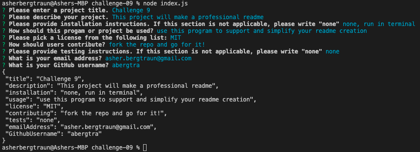
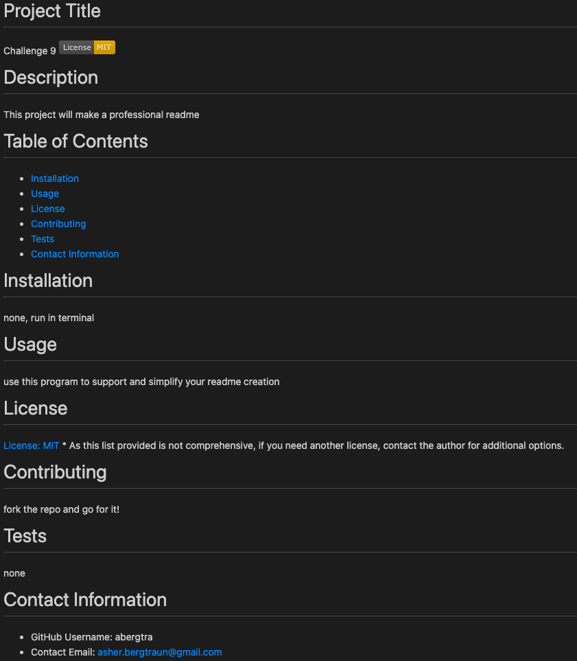

# challenge-09
# Description
Auto-generate a professional README.md file from User Input using a command-line application, node.js, and the Inquirer package.

# Table of Contents
* [Links](#-Links)
* [Usage](#-Usage)
* [License](#-License)
* [Contributing](#-Contributing)
* [Tests](#-Tests)
* [Questions](#-Questions)

# Links
[GitHub URL](https://github.com/abergtra/challenge-09)

# Usage
Please follow [this link](https://www.youtube.com/watch?v=FIrtApTkNEE) to see a walkthrough on Youtube.

Use terminal commands and answer the prompts:


Here is an example of the expected final product:


# License
none.

# Contributing
Please contact the author if you would like to contribute to this project.

# Tests
This program can be tested through the terminal
Please contact the author if you have specific testing requests.

# Questions
If you have any questions, please contact:
```bash
Asher Bergtraun
Email: asher.bergtraun@gmail.com
GitHub Username: abergtra
```
